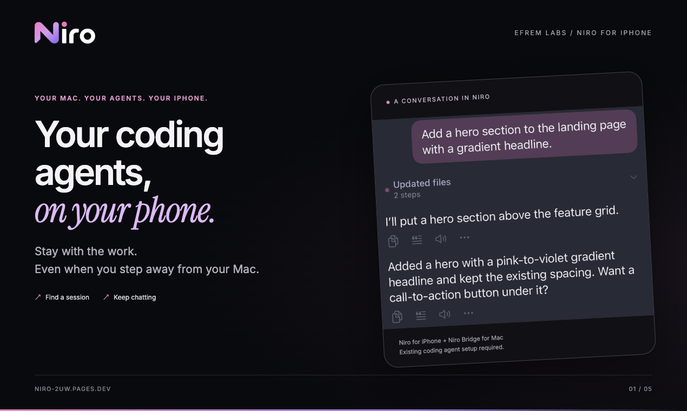
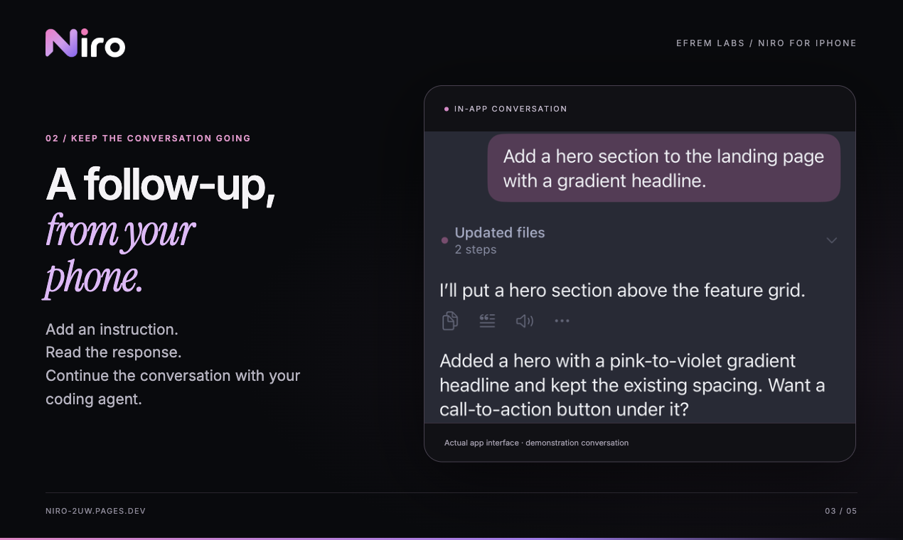
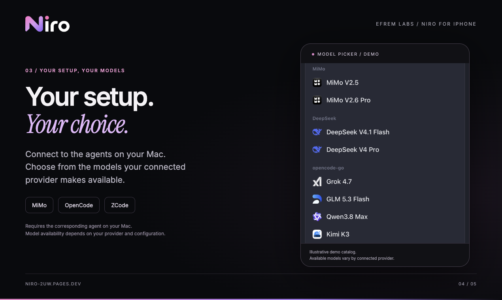

# Niro

**Your Coding Agents, on Your Phone.**

Niro is a free iPhone companion for the coding agents running on your Mac. Pick up a session, send the next instruction, check progress, and switch between supported providers without staying at your desk.

[**App Store**](https://apps.apple.com/app/niro/id6815434350) · [**Website**](https://niro-2uw.pages.dev) · [**Download Niro Bridge**](https://github.com/efrem-labs/niro-releases/releases/latest)

## Supported agents

- **MiMo Desktop**
- **OpenCode**
- **ZCode**

Niro Bridge normalizes the different local interfaces used by these agents into one phone-friendly connection.

## How it works

1. Install **Niro** on your iPhone.
2. Install **Niro Bridge** on your Mac.
3. Open Niro Bridge. It lives quietly in the macOS menu bar.
4. Pair your iPhone and Mac on the same local network.
5. Continue your existing coding-agent sessions from the phone.

For use away from your local network, your Mac must remain reachable through your network setup, such as Tailscale.

## Keep the conversation going

Read the response, add a follow-up, and keep a task moving while you are away from the Mac.

## Your setup, your models

Niro uses the providers and models already available through your Mac setup. Availability varies by provider and configuration.

## Niro Bridge for macOS

Niro Bridge is the small macOS companion that connects Niro on iPhone to supported coding agents running on the Mac.

- Menu-bar app
- Local pairing with explicit approval on the Mac
- Supports MiMo Desktop, OpenCode, and ZCode
- No Niro account required

Download the latest build from [**Releases**](https://github.com/efrem-labs/niro-releases/releases/latest).

## Free

Niro is completely free. Optional in-app tips support EFREM Labs and do not unlock features.

## About this repository

This public repository contains **Niro Bridge release binaries and product documentation**. The Niro iPhone app is distributed through the App Store. The application source code is not published here.

Made by **EFREM Labs**.
